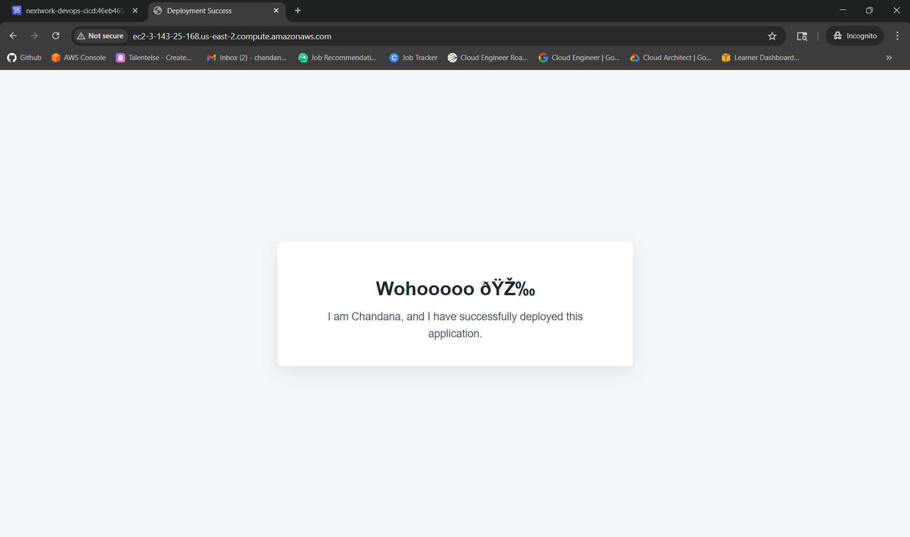

# AWS CI/CD Pipeline for Java Web Application

This project demonstrates a **complete end-to-end CI/CD pipeline on AWS** that automates the **build, packaging, and deployment** of a Java web application to an Amazon EC2 instance.

The pipeline is built using AWS-native DevOps services and follows **real-world production practices**, including secure artifact management, infrastructure as code, and automated deployments with rollback.

---

## 📌 Project Overview

The objective of this project was to eliminate manual deployment steps and design a **secure, reliable, and repeatable CI/CD workflow**.

With this pipeline in place:
- Code pushed to GitHub is built automatically
- Dependencies are securely managed
- Infrastructure is provisioned through code
- Deployments to EC2 happen with zero manual intervention

---

## 🛠️ Tools & Technologies Used

- **Amazon EC2** – Application hosting (Apache + Tomcat)
- **AWS IAM** – Secure access control
- **AWS CodeArtifact** – Secure Maven dependency management
- **AWS CodeBuild** – Build automation
- **Amazon S3** – Artifact storage
- **AWS CodeDeploy** – Automated application deployment
- **AWS CloudFormation** – Infrastructure as Code
- **GitHub** – Source code management
- **Maven** – Java build tool

---

## ⚙️ CI/CD Pipeline Breakdown

### Build Stage
- GitHub repository integrated with AWS CodeBuild
- `buildspec.yml` used to:
  - Authenticate with CodeArtifact
  - Compile the application
  - Package the application into a `.war` file
- Build artifacts stored in Amazon S3

### Deployment Stage
- CodeDeploy application and deployment group created
- EC2 instances targeted using tags
- Deployment lifecycle managed using:
  - `appspec.yml`
  - Shell scripts for install, start, and stop actions
- Automatic rollback enabled on deployment failure

### Infrastructure
- EC2, networking, and IAM roles provisioned using CloudFormation
- Rollback enabled to prevent partial resource creation

---

## ✅ Final Result

The application was successfully deployed to an EC2 instance and verified using
the public DNS, confirming the CI/CD pipeline works end to end.

---

## 📚 What I Learned

- Designing and implementing a complete CI/CD pipeline on AWS
- Secure artifact and dependency management using CodeArtifact
- Writing and debugging `buildspec.yml` and `appspec.yml`
- Infrastructure provisioning using CloudFormation
- Automated deployments with lifecycle hooks and rollback
- Applying least-privilege IAM roles
- Troubleshooting real-world CI/CD and deployment issues

---

## 🎯 Why This Project Matters

This project mirrors **real production DevOps workflows**:
- Fully automated builds and deployments
- Secure, controlled artifact handling
- Infrastructure defined and managed as code
- Scalable and repeatable pipeline design

---

## 👤 Author

**Chandana Krishna**  
Cloud & DevOps Enthusiast  

